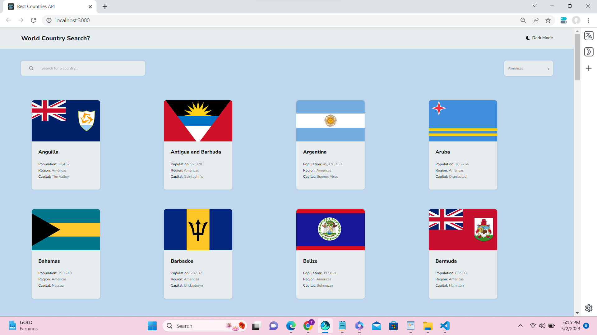
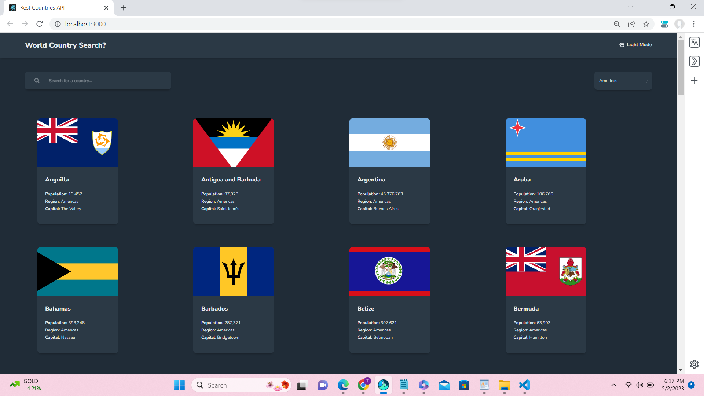
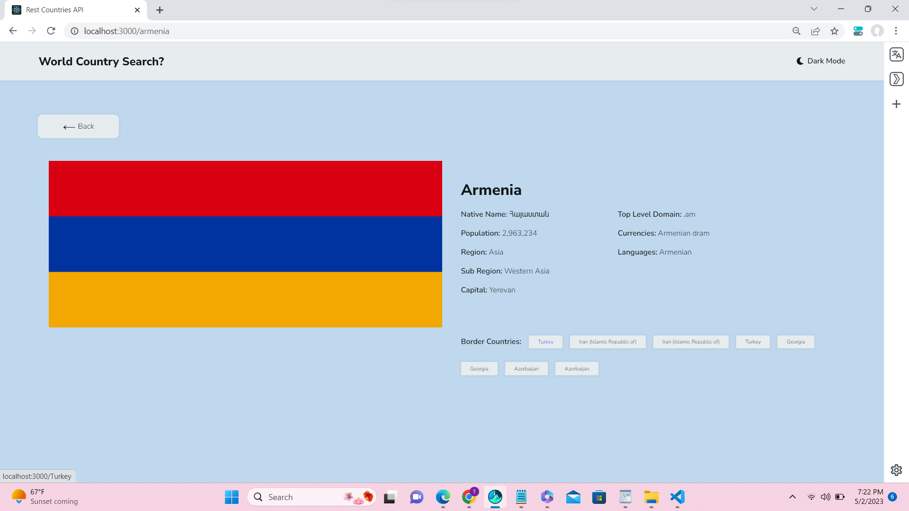
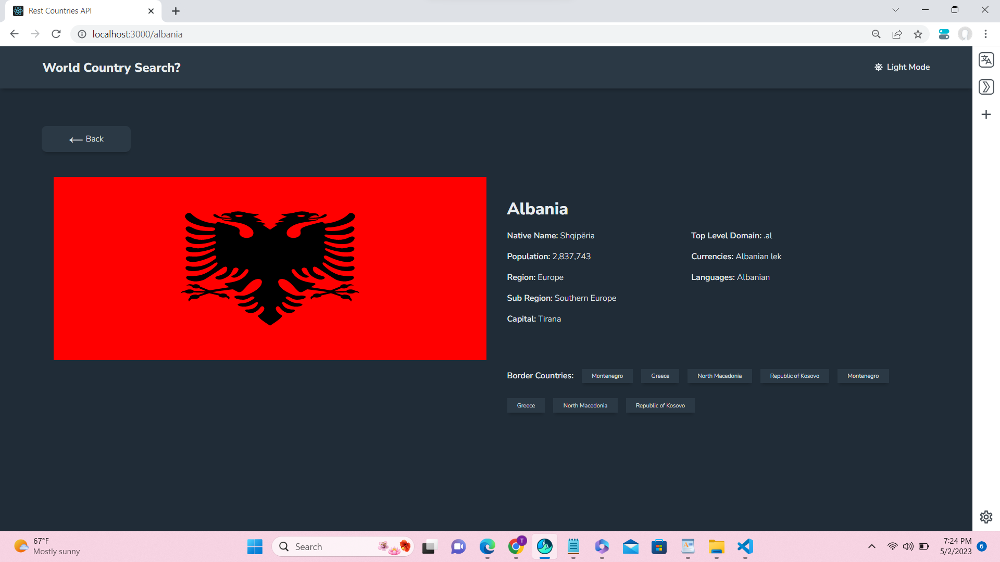

# Overview
## World Country Search?

 This project was mainly about fetching and extracting data from REST API and then converting it to a list of countries. The list can be filtered in two ways: by the country name and the region where it is located. The filtering can be performed simultaneously. Once a user click on one of the countries, they will be forwarded to another page which shows more detailed information. If a country has border coutries, a list of them will be rendered at the end of the information section and the user also can click on them to be forwarded to that country details page. 
 The user can switch between two themes: light and dark, by clicking on the theme button on the top right corner of the page. 
 While the data is being fetched, a fallback loading UI is rendered to show the user that something is happeing behind the scenes. 
 There is also an error page which content is depended on the type of the error. If the data has failed to be fetched, a new Response is thrown and it contains an error code of status 500. If this status is present, the provided feedback will say that retrieving the data was not successful. However, if the user tries to enter a path that does not exist, the error will say that it was unable to access the page and the user can go back to the homepage. 
 This project was built with React.js, React Router and Redux Toolkit. The data is fetched from REST API (https://restcountries.com/). Other concepts that were used while building this project were Responsive Web Design and Mobile-First Workflow as well as semantic and accessible markup. 

## The challenge
### Basic functionalities: 
Unordered List :-

*   Displaying all countries fetched from the API on the main page.
*   Searching for a country using by entering a country name in the input field.
*   Filtering countries by region using the dropdown list.
*   Clicking on a country will forward the user to a separate page which contains more detailed     information about the country
* The user can click through the border countries (if they are present) on the country details page.

### Additional functionalities: 
* Toggling the color scheme between light and dark.
* Loading page - I have used setTimeout to slow down receiving data from the loader() function in order to show a loading page component in the UI.
*  Error page - will be displayed if user tries to access an invalid path or if the data has failed to be fetched, feedback provided on the error page is different in those two cases.
* If a country does not have any border countries, this segment simply will not be rendered.
#### Built with
*  HTML  markup
* CSS modules
* JavaScript
* React.js
* React Redux Toolkit
* React Router
* REST API
### Useful resources

* Rest Countries API - information about countries via a RESTful API
* Framer Motion - React library for animations
* React-Libraries.

### Screenshots:

### Light mode of Display.

### Dark Mode of Display.

##### Displaying border countries in light mode.

##### Displaying border countries in dark mode.
Figma
#### What I learned
I've picked up this project to revise some major concepts of , React Router and REST API. It was also a great project to practice filtering and sorting items that are being rendred on the page. 
### Building your project
Initialize your project as a public repository on GitHub. Creating a repo will make it easier to share code with the community .  
Look through the designs to start planning out how you'll tackle the project. This step is crucial to help you think ahead for CSS classes to create reusable styles and code. 
### some commande used:
npx create-react-app my-app
cd my-app
npm install react-router-dom
npm start
### Deploying  project:
GitHub Pages
Render

#### 🙏 Acknowledgments
I would like to thank, my friends and my mentors in Per scholars.

I like the project concept it was a challenge in frontend Mentor I wanted to solve it according to my coding skills andgot   helped from stalk over flow and dev community.
#### 👥 Author
TR...li.

